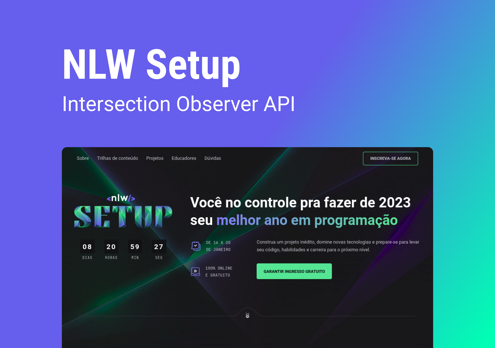

# Nlw Setup | Intersection Observer API

> Development of a web landing page, this project was developed following the layout of the Landing Page of the Rocketseat NlW Setup Event, and
> aims to create an attractive and functional web interface for the presentation of a product or service. For this, the following were used:
> tools and/or utilities: `Sticky`: to fix elements on the screen during scrolling, such as a navigation menu or a call to action. `Accordion`: 
> to show and hide information in a list in an interactive and organized way. `Parallax`: to create a 3D visual effect with layers of elements 
> that move with different speeds when scrolling the page. `Marquee`: to create a continuous scrolling animation of text or image. `IntersectionObserver`:
> to control the display of elements on the page according to their position on the screen. `Layout animations`: to create smooth and fluid animations 
> for the presentation of elements on the page. In addition, usability, accessibility and responsiveness were considered to ensure a good user experience 
> on different devices and screen sizes. The landing page will be designed with a clean and modern layout, highlighting key information and calls
> to action for the visitor.

:arrow_right: Intersection Observer API   
:arrow_right: Marquee   
:arrow_right: Sticky   
:arrow_right: Accordion  
:arrow_right: Parallax  

 
